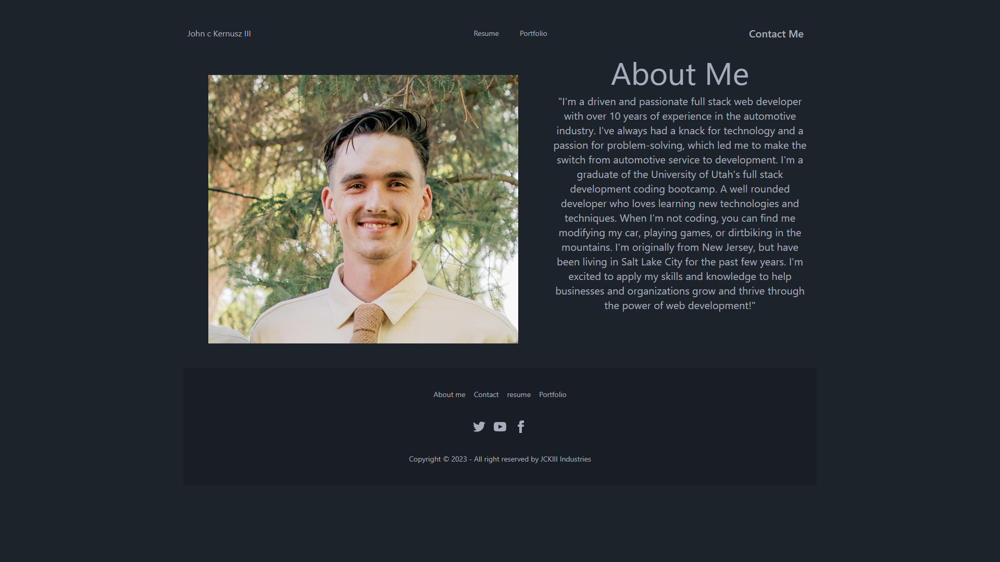

Sure! Here's a possible template for a README file:

# React-Portfolio

Personal coding portfolio built on react/vite Software

## Table of Contents

- [Installation](#installation)
- [Usage](#usage)
- [License](#license)
- [Contributing](#contributing)
- [Tests](#tests)
- [Questions](#questions)

## Installation

no installation required

## Usage

for personal use only

## License

This project is licensed under the MIT License - see the [LICENSE.md](https://github.com/your-username/project-name/blob/main/LICENSE.md) file for details

## Contributing

please send a pull request if you wanna make my portfolio better

## link to deployed project

## image of project
